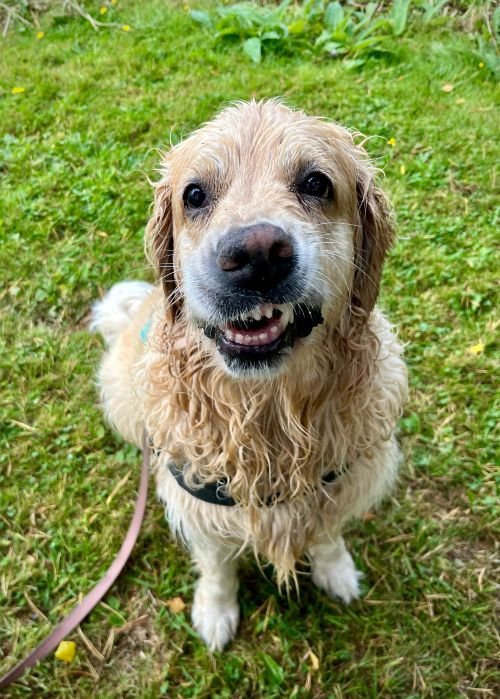

# Hei vain!


```
{
  "firstName": "Anniina",
  "lastName": "Kallioinen",
  "DOB": 30.12.1991
  "age": 34
}
```


## Nimeni on Anniina Kallioinen ja kerron nyt jotain itsestäni.


Olen kotoisin **Haapajärveltä** ja asuttuani aikuisiällä...
- Kuopiossa
- Keuruulla
- Asikkalassa
- Hyvinkäällä
  
... muutin lopulta takaisin tänne *maaseudun rauhaan* syksyllä 2023.

Jos minun pitäisi kuvailla itseäni yhdellä lauseella, olisi se
> Olen hauska, suorastaan naurettava.

---


### Millaisista asioista pidän?
1. Eläimistä, erityisesti koirastani Almasta
2. Ulkoilusta ja metsäseikkailuista
3. Musiikin ja podcastien kuuntelusta
4. Tietokonepelaamisesta
5. Ruuanlaitosta ja leipomisesta

Tässä kuva Alma-koirasta:



---

Olen tieto- ja viestintätekniikan opiskelija Centria-ammattikorkeakoulussa.
[Centrian nettisivut](https://net.centria.fi/)


| Aikaisemmat tutkintoni | Valmistumisvuosi |
| ----------- | ----------- |
| Ylioppilas | 2010 |
| Puutarhuri | 2016 |
| Leipuri | 2022 |
